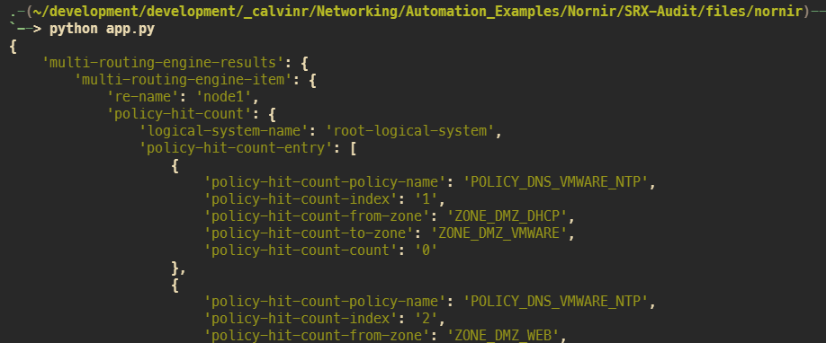

# Juniper SRX Audit

This example will show how to use the PyEZ plugin for Nornir to

1. build a NETCONF connection to a remote device
2. request policy match information
3. report any firewall policies that do not have a match
4. close the connection

## 🚀 Workflow

We have provided a [Poetry](https://python-poetry.org/docs/) lock file to make life simple when managing Python packages and virtual environments. Within the virtual vironment, there will be a package called [Invoke](http://www.pyinvoke.org/) that will help us run our script with a simple command.

The workflow will look like this:

1. Install Poetry (one-time operation)
2. Have Poetry install your Python packages in a virtual environment (one-time operation)
3. Activate your new virtual environment with Poetry
4. Run locally or within a container using the Invoke package

### 🐍 Create and Activate your Python environment (one time operation)

1. install poetry package to manage our Python virtual environment 

```sh
curl -sSL https://raw.githubusercontent.com/python-poetry/poetry/master/get-poetry.py | python -
```

2. install our Python dependencies 

```sh
poetry install
```

3. activate your Python virtual environment

```sh
poetry shell
```

### Executing the script

1. run your Nornir script locally

```sh
cd files/nornir
python app.py
```

### Using Docker

1. build the container image with

```sh
invoke build
```

2. run the Nornir script within the container

```sh
invoke nornir
```

## ⚙️ How it works

Let's take a second to do a nice John Madden play-by-play on this script:

### Importing the functionality of PyEZ and Nornir into our script

```python
from nornir_pyez.plugins.tasks import pyez_rpc
from nornir import InitNornir
from rich import print
import os
```

- We need to import the `pyez_rpc` method from Nornir's PyEZ plugin into our script
- `InitNornir` will import the core functionality of Nornir
- `rich` will make things pretty when we print the output
- `import os` is just to allow us to shortcut the path of your directory

### Defining parameters

```python
script_dir = os.path.dirname(os.path.realpath(__file__))

nr = InitNornir(config_file=f"{script_dir}/config.yaml")

firewall = nr.filter(name="juniper-srx-garage0")

extras = {
    "less-than": "1"
}
```

- create an object called `script_dir` and set it to our local directory
- `nr` is created by instantiation the `InitNornir` class and passing our config file into it
- we filter out a single device with the `nr.filter` method and passing a hostname
- any extra parameters for our RPC call will be defined here in a key/value structure

### Sending our API call

```python
response = firewall.run(
    task=pyez_rpc, func='get-security-policies-hit-count', extras=extras
)
```

- create a new object called `response` and setting it equal to the response of our API call
- the `run` function was imported when we created an object `firewall` based on the `InitNornir` class
- within `run`, we pass the `task` as a `pyez_rpc`, our RPC API call, and `extra` parameters

### Print

```python
for dev in response:
    print(response[dev].result)
```

Loop over the `response` object, which is an AggregatedResult that behaves like a list. There is a response object for each device in inventory

## 📸 Screenshot



## 📝 Additional Notes

### 🐍 Python

You are *strongly* recommended to using a Python Virtual Environment any and everywhere possible. You can really mess up your machine if you're too lazy and say "ehh, that seems like it's not important". It is. If it sounds like I'm speaking from experience, I'll never admit to it.

If you're interested in learning more about setting up Virtual Environments, I encourage you to read a few blogs on the topic. A personal recommendation would be

- [Poetry](https://python-poetry.org/docs/)
- [Digital Ocean (macOS)](https://www.digitalocean.com/community/tutorials/how-to-install-python-3-and-set-up-a-local-programming-environment-on-macos)
- [Digital Ocean (Windows 10)](https://www.digitalocean.com/community/tutorials/how-to-install-python-3-and-set-up-a-local-programming-environment-on-windows-10)

### 🐳 Docker

If you are unsure if Docker is installed on your computer, then it's probably safe to suggest that it's not. If you're interested in learning more about the product, I encourage you to read a few blogs on the topic. A personal recommendation would be [Digital Ocean](https://www.digitalocean.com/community/tutorial_collections/how-to-install-and-use-docker#:~:text=Docker%20is%20an%20application%20that,on%20the%20host%20operating%20system.)

Some of the goodies placed in the `docker` folder are not relevant to our use case with Python. Feel free to delete them as you see fit, I simply wanted to share with you my Docker build process for all Juniper automation projects (including those based on Ansible). The world is your oyster and I won't judge you on whatever direction you take.

### 📝 Dependencies

Refer to the file located at [files/docker/requirements.txt](files/docker/requirements.txt)
